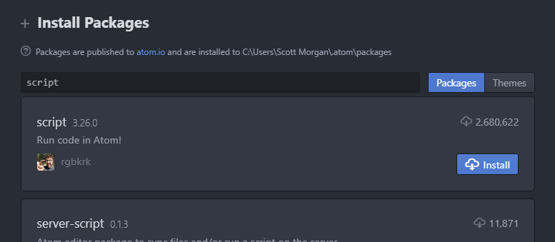
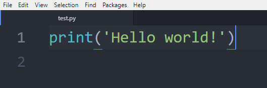
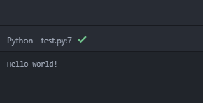
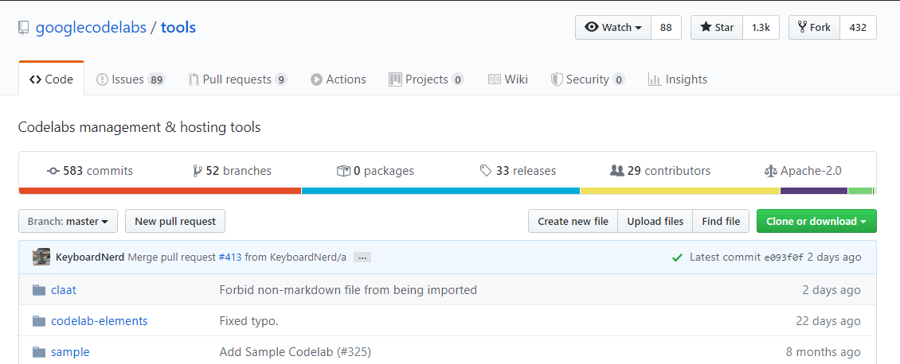

author: Scott Morgan
summary: Setting up git and virtual environments
id: local-development-environment
categories: python-programming
environments: Web
status: Published
feedback link: https://github.com/Scott3142/python-programming
analytics account: UA-49751789-4

# Local Development Environments

## Using a local development environment
Duration: 01:00:00

### What you'll learn
* Become familiar with the Atom development environment used in this course.
* How to download and submit programming exercises.

As discussed in the Getting Started section, the text editor we recommend and support on this course is called Atom. Atom is not [technically](https://www.quora.com/Is-Atom-an-IDE-or-Text-Editor) an IDE, but comes with many useful plugins that can be used to mimic the functionality of an IDE. We will use the `script` and `atom-python-test` plugins predominantly on this course.

To start setting up a local development environment, you will need:

1. Python installed on your computer
2. Atom development environment

Installation instructions for Python and Atom can be found below:

- [Python installation guide (Windows)](https://www.python.org/downloads/)
- [Atom installation guide (Windows)](https://flight-manual.atom.io/getting-started/sections/installing-atom/)

Once you have created the user account and installed Python and Atom, watch the video below. The video demonstrates what happens when Atom is opened for the first time. We log into Github and do the first programming exercise.

replace-with-video

Positive
: **Exercise - Sandbox** <br><br> Read the instructions for the exercise and commit the solution via Github. <br><br> [Source files on Github](https://github.com/den01-python-programming/sandbox.git)

### Running Python commands in Atom

The Atom development environment has several packages available which allow you to run your Python programs directly inside the editor. The most popular of these at the time of writing is the `script` package. You can read more about `script` at [this link](https://atom.io/packages/script).

To install the `script` package, open Atom and click on the _packages_ tab in the toolbar. Go to _Settings View_ and click _Install Packages/Themes_.


Search for the `script` package and click _Install_.



Once it has installed, go and create a `test.py` file in your sandbox and enter `print("Hello world!")`. You can alternatively use any Python `.py` file for this step.



You should see an output in the bottom left of the screen which contains the contents of your program's output. If there are any errors in your code, the stack trace will also show up here.



It is important to be able to successfully complete these steps to be able to continue to access the material in this course.

Positive
: For the vast majority of the exercises, it will suffice to run your Python programs in this way. However, if you require virtual environments, `pip` installs or testing frameworks, it is crucial to understand how to run commands in the terminal and make this your preferred option. We will cover this in the following section.

## The command line
Duration: 00:30:00

### What you'll learn
* How to run Python commands in the terminal
* Some key commands to know in Linux

If you've never used the command line before, it can be quite daunting but once you get used to it you'll wonder how you ever worked without it.

The terminal (or 'command-line') on a computer allows a user a great deal of control over their system. Users of Windows may already have come across Command Prompt or Powershell and Mac OS users may be familiar with Terminal. All of these tools allow a user to directly manipulate their system through the use of commands. These commands can be chained together and/or combined together into complex scripts that can potentially complete tasks more efficiently than much larger traditional software packages.

The following is adapted from [these Raspberry Pi foundation resources](https://www.raspberrypi.org/documentation/).

### The terminal in operating systems that aren't Linux

This course focuses mainly on a Linux environment, which can be utilised in Windows through the [Windows Subsystem for Linux](https://docs.microsoft.com/en-us/windows/wsl/install-win10). If you are using alternative terminals or operating systems, you can check out the guides below:

- [Mac OS](https://blog.teamtreehouse.com/introduction-to-the-mac-os-x-command-line)
- [Windows Powershell](https://programminghistorian.org/en/lessons/intro-to-powershell)

### Running Python commands in the terminal

If you have a directory structure containing some `.py` files, which you will have if you successfully downloaded the [sandbox exercise](https://github.com/den01-python-programming/sandbox.git), you should see something like the following directory structure. You can view this either in your usual folder structure, or through the command line itself:

```plaintext
.
+-- README.md
+-- sandbox.py
```

There may be multiple files in the directory, depending on the repo that you've cloned, but if there's a Python file in there, it will always have the extension `.py`. You can compile and run the `sandbox.py` file using the following command from a terminal:

```bash
python3 sandbox.py
```

Your full command prompt will probably look something like this:

```bash
user@host:~$ python3 main.py
```

if you're on Linux, or like this:

```bash
PS C:\Users\User> python3 main.py
```

if you're on Windows and using Powershell. Throughout this section, the first part of the command (either `user@host:~$` for Linux or `PS C:\Users\User>` for Windows) is not to be typed into the command line. This is just to illustrate to you what the full prompt should look like in each case.

If you get an error saying that `python3` is not recognised as a command, [make sure it's installed](https://www.python.org/downloads/).

Positive
: **Note:** <br><br> If you are using Atom as a development environment, you can run your Python programs from inside the editor with the `script` package. Once you have installed the `script` package, you can run your program with `Ctrl-Shift-B`. More information on the `script` package can be found [here](https://atom.io/packages/script).

### The terminal in Linux

If you are not using Linux or the [Windows Subsystem for Linux](https://docs.microsoft.com/en-us/windows/wsl/install-win10), you can freely skip ahead to the [next part](https://scott3142.uk/python-programming/codelabs/getting-started/index.html?index=..%2F..index#1).

If you are using the [Windows Subsystem for Linux](https://docs.microsoft.com/en-us/windows/wsl/install-win10), open it according to the instructions contained on that page, otherwise search for `Terminal` in your installed software and open it. You should be greeted with a command prompt that looks something like:

```bash
user@host:~$
```

This shows your username and the hostname of the machine you are working on.

Now, let's try running a command. Type `pwd` (present working directory) followed by the Enter key. This should display something like `/home/username`.

One of the key aspects of using a terminal is being able to navigate your file system. Firstly, run the following command: `ls -la`. You should see a list of files and folders.

The `ls` command lists the contents of the directory that you are currently in (your present working directory). The `-la` component of the command is what's known as a 'flag'. Flags modify the command that's being run. In this case the `l` displays the contents of the directory in a list, showing data such as their sizes and when they were last edited, and the a displays all files, including those beginning with a ., known as 'dotfiles'. Dotfiles usually act as configuration files for software and as they are written in text, they can be modified by simply editing them.

In order to navigate to other directories the change directory command, `cd`, can be used. You can specify the directory that you want to go to by either the 'absolute' or the 'relative' path. So if you wanted to navigate to the `Downloads` directory, you could either do `cd /home/username/Downloads` or just `cd Downloads` (if you are currently in `/home/username`). There are some special cases that may be useful: `~` acts as an alias for your home directory, so `~/Downloads` is the same as `/home/username/Downloads`; `.` and `..` are aliases for the current directory and the parent directory respectively, e.g. if you were in `/home/username/Downloads`, cd .. would take you to `/home/username`.

### History and auto-complete

Rather than type every command, the terminal allows you to scroll through previous commands that you've run by pressing the `up` or `down` keys on your keyboard. If you are writing the name of a file or directory as part of a command then pressing `tab` will attempt to auto-complete the name of what you are typing. For example, if you have a file in a directory called `aLongFileName` then pressing tab after typing `a` will allow you to choose from all file and directory names beginning with `a` in the current directory, allowing you to choose `aLongFileName`.

### Sudo

The Linux operating system is a multi-user operating system which allows multiple users to log in and use the computer. To protect the computer (and the privacy of other users), the users' abilities are restricted.

Most users are allowed to run most programs, and to save and edit files stored in their own home folder. Normal users are not normally allowed to edit files in other users' folders or any of the system files. There's a special user in Linux known as the **superuser**, which is usually given the username `root`. The superuser has unrestricted access to the computer and can do almost anything.

You won't normally log into the computer as `root`, but you can use the `sudo` command to provide access as the superuser. If you log into your computer as `username`, then you're logging in as a normal user. You can run commands as the `root` user by using the `sudo` command before the program you want to run.

For example, if you want to install additional software then you normally use the `apt` tool. To update the list of available software, you need to prefix the `apt` command with sudo:

`sudo apt update`

You can also run a superuser shell by using `sudo su`. When running commands as a superuser there's nothing to protect against mistakes that could damage the system. It's recommended that you only run commands as the superuser when required, and to exit a superuser shell when it's no longer needed.

### Who can use sudo?

It would defeat the point of the security if anyone could just put `sudo` in front of their commands, so only approved users can use `sudo` to gain administrator privileges. The `username` user is included in the `sudoers` file of approved users. To allow other users to act as a superuser you can add the user to the `sudo` group with `usermod`, edit the `/etc/sudoers` file, or add them using `visudo`.

### Installing software using apt

You can use the `apt` command to install software. This is the 'package manager' that is included with any Debian-based Linux distributions including Ubuntu. It allows you to install and manage new software packages on your Pi. In order to install a new package, you would type `sudo apt install <package-name>` (where `<package-name>` is the package that you want to install). Running `sudo apt update` will update a list of software packages that are available on your system. If a new version of a package is available, then `sudo apt full-upgrade` will update any old packages to the new version. Finally, `sudo apt remove <package-name>` removes or uninstalls a package from your system.

### Other useful commands

There are a few other commands that you may find useful, these are listed below:

### ls

The `ls` command lists the content of the current directory (or one that is specified). It can be used with the `-l` flag to display additional information (permissions, owner, group, size, date and timestamp of last edit) about each file and directory in a list format. The `-a` flag allows you to view files beginning with `.` (i.e. dotfiles).

### cd

Using `cd` changes the current directory to the one specified. You can use relative (i.e. `cd directoryA`) or absolute (i.e. `cd /home/username/directoryA`) paths.

### pwd

The `pwd` command displays the name of the present working directory: on a Linux system, entering `pwd` will output something like `/home/username`.

### mkdir

You can use `mkdir` to create a new directory, e.g. `mkdir newDir` would create the directory `newDir` in the present working directory.

### rmdir

To remove empty directories, use `rmdir`. So, for example, `rmdir oldDir` will remove the directory `oldDir` only if it is empty.

### rm

The command `rm`removes the specified file (or recursively from a directory when used with `-r`). Be careful with this command: files deleted in this way are mostly gone for good!

### cp

Using `cp` makes a copy of a file and places it at the specified location (this is similar to copying and pasting). For example, `cp ~/fileA /home/otherUser/` would copy the file `fileA` from your home directory to that of the user `otherUser` (assuming you have permission to copy it there). This command can either take `FILE FILE` (`cp fileA fileB`), `FILE DIR` (`cp fileA /directoryB/`) or `-r DIR DIR` (which recursively copies the contents of directories) as arguments.

### mv

The `mv` command moves a file and places it at the specified location (so where `cp` performs a 'copy-paste', `mv` performs a 'cut-paste'). The usage is similar to `cp`. So `mv ~/fileA /home/otherUser/` would move the file `fileA` from your home directory to that of the user otherUser. This command can either take `FILE FILE` (`mv fileA fileB`), `FILE DIR` (`mv fileA /directoryB/`) or `DIR DIR` (`mv /directoryB /directoryC`) as arguments. This command is also useful as a method to rename files and directories after they've been created.

### touch

The command `touch` sets the last modified time-stamp of the specified file(s) or creates it if it does not already exist.

### cat

You can use `cat` to list the contents of file(s), e.g. `cat thisFile` will display the contents of `thisFile`. Can be used to list the contents of multiple files, i.e. `cat *.txt` will list the contents of all `.txt` files in the current directory.

### head

The `head` command displays the beginning of a file. Can be used with `-n` to specify the number of lines to show (by default ten), or with `-c` to specify the number of bytes.

### tail

The opposite of `head`, `tail` displays the end of a file. The starting point in the file can be specified either through `-b` for 512 byte blocks, `-c` for bytes, or `-n` for number of lines.

### chmod

You would normally use `chmod` to change the permissions for a file. The `chmod` command can use symbols `u` (user that owns the file), `g` (the files group) ,  and `o` (other users) and the permissions `r` (read), `w` (write), and `x` (execute). Using `chmod u+x *filename*` will add execute permission for the owner of the file.

### chown

The `chown` command changes the user and/or group that owns a file. It normally needs to be run as root using sudo e.g. `sudo chown username:root *filename*` will change the owner to username and the group to root.

### ssh

`ssh` denotes the secure shell. Connect to another computer using an encrypted network connection.

### scp

The `scp` command copies a file from one computer to another using `ssh`.

### dd

The `dd` command copies a file converting the file as specified. It is often used to copy an entire disk to a single file or back again. So, for example, `dd if=/dev/sdd of=backup.img` will create a backup image from an SD card or USB disk drive at /dev/sdd. Make sure to use the correct drive when copying an image to the SD card as it can overwrite the entire disk.

### df

Use `df` to display the disk space available and used on the mounted filesystems. Use `df -h` to see the output in a human-readable format using M for MBs rather than showing number of bytes.

### unzip

The `unzip` command extracts the files from a compressed zip file.

### tar

Use `tar` to store or extract files from a tape archive file. It can also reduce the space required by compressing the file similar to a zip file.

To create a compressed file, use `tar -cvzf *filename.tar.gz* *directory/*`
To extract the contents of a file, use `tar -xvzf *filename.tar.gz*`

### pipes

A pipe allows the output from one command to be used as the input for another command. The pipe symbol is a vertical line `|`. For example, to only show the first ten entries of the `ls` command it can be piped through the head command `ls | head`

### tree

Use the `tree` command to show a directory and all subdirectories and files indented as a tree structure.

### &

Run a command in the background with `&`, freeing up the shell for future commands.

### curl

Use `curl` to download or upload a file to/from a server. By default, it will output the file contents of the file to the screen.

### man

Show the manual page for a file with `man`. To find out more, run `man man` to view the manual page of the man command.

### grep

Use `grep` to search inside files for certain search patterns. For example, `grep "search" *.txt` will look in all the files in the current directory ending with .txt for the string search.

The `grep` command supports regular expressions which allows special letter combinations to be included in the search.

### awk

`awk` is a programming language useful for searching and manipulating text files.

### find

The `find` command searches a directory and subdirectories for files matching certain patterns.

### whereis

Use `whereis` to find the location of a command. It looks through standard program locations until it finds the requested command.

### ping

The `ping` utility is usually used to check if communication can be made with another host. It can be used with default settings by just specifying a hostname (e.g. `ping google.com`) or an IP address (e.g. `ping 8.8.8.8`). It can specify the number of packets to send with the `-c` flag.

### nmap

`nmap` is a network exploration and scanning tool. It can return port and OS information about a host or a range of hosts. Running just `nmap` will display the options available as well as example usage.

### hostname

The `hostname` command displays the current hostname of the system. A privileged (super) user can set the hostname to a new one by supplying it as an argument (e.g. `hostname new-host`).

### ifconfig

Use `ifconfig` to display the network configuration details for the interfaces on the current system when run without any arguments (i.e. `ifconfig`). By supplying the command with the name of an interface (e.g. `eth0` or `lo`) you can then alter the configuration: check the manual page for more details.

### Finding out about a command

To find out more information about a particular command then you can run the `man` followed by the command you want to know more about (e.g. `man ls`). The man-page (or manual page) for that command will be displayed, including information about the flags for that program and what effect they have. Some man-pages will give example usage.

## Installing packages with pip
Duration: 00:20:00

### What you'll learn
* What pip is and how to use it
* What the requirements file is

### What is pip?

The following is adapted from [here](https://realpython.com/what-is-pip/).

Pip is the standard package manager for Python which allows you to install and manage packages which are not part of the [Python standard library](https://docs.python.org/3/py-modindex.html). Much like `npm` for JavaScript, `gem` for Ruby or even `apt` for Debian, `pip` allows you to install and manage additional libraries and dependencies for your projects. If you have installed Python on your machine, the Python installer installs pip, so it should be ready for you to use.  You can verify that pip is available by running the following command in your console:

```bash
user@host:~$ pip --version
```

A lot of commonly used packages are included as standard in the [Python standard library](https://docs.python.org/3/py-modindex.html), which includes an extensive set of packages and modules to help developers with their scripts and applications.

Sometimes, however, you'll need functionality that isn't included as standard, for example `numpy` or `scipy` if you're doing scientific computing and for that you'll want to look in the [Python Package Index](https://pypi.org/), otherwise known as PyPI. To install these packages, you can use `pip`.

Typing `pip help` into your command prompt should return something like the following:

```plaintext
Usage:
  pip <command> [options]

Commands:
  install                     Install packages.
  download                    Download packages.
  uninstall                   Uninstall packages.
  freeze                      Output installed packages in requirements format.
  list                        List installed packages.
  show                        Show information about installed packages.
  check                       Verify installed packages have compatible
                              dependencies.
  config                      Manage local and global configuration.
  search                      Search PyPI for packages.
  wheel                       Build wheels from your requirements.
  hash                        Compute hashes of package archives.
  completion                  A helper command used for command completion.
  help                        Show help for commands.

General Options:
  -h, --help                  Show help.
  --isolated                  Run pip in an isolated mode, ignoring environment
                              variables and user configuration.
  -v, --verbose               Give more output. Option is additive, and can be
                              used up to 3 times.
  -V, --version               Show version and exit.
  -q, --quiet                 Give less output. Option is additive, and can be
                              used up to 3 times (corresponding to WARNING,
                              ERROR, and CRITICAL logging levels).
  --log <path>                Path to a verbose appending log.
  --proxy <proxy>             Specify a proxy in the form
                              [user:passwd@]proxy.server:port.
  --retries <retries>         Maximum number of retries each connection should
                              attempt (default 5 times).
  --timeout <sec>             Set the socket timeout (default 15 seconds).
  --exists-action <action>    Default action when a path already exists:
                              (s)witch, (i)gnore, (w)ipe, (b)ackup, (a)bort).
  --trusted-host <hostname>   Mark this host as trusted, even though it does
                              not have valid or any HTTPS.
  --cert <path>               Path to alternate CA bundle.
  --client-cert <path>        Path to SSL client certificate, a single file
                              containing the private key and the certificate in
                              PEM format.
  --cache-dir <dir>           Store the cache data in <dir>.
  --no-cache-dir              Disable the cache.
  --disable-pip-version-check
                              Don't periodically check PyPI to determine
                              whether a new version of pip is available for
                              download. Implied with --no-index.
```

As you can see, `pip` provides an install command to install packages. You can run it to install the `numpy` package. Run the following `pip install numpy` from a command prompt.

```bash
user@host:~$ pip install numpy
```

As you can see, there are plenty of other useful commands available with `pip` but we will only explore a few of them here. You can find out more comprehensive information about `pip` in the [docs](https://pip.pypa.io/en/stable/).

### Package versions and the requirements file

If you've downloaded a Python project that someone else has written or you've explored some of the Python repos on Github, you might have noticed a `requirements.txt` file in the root directory. This is used to tell anyone running the code (including the original developer) which versions of installed packages were used to develop and test the application, so there are no surprises when deploying to production.

Let's use an example. Say your project is using `numpy` to calculate the standard deviation of a dataset. The latest version of `numpy` available at the time of writing is `v1.18.3` so we use that to create our project.

Sometime later, `numpy` releases a new version which changes the way the standard deviation is called - the output array which used to be optional is now required in the method call. Your code would no longer work with a fresh install of `numpy`, and your project would break through no fault of your own.

With a package as popular as `numpy`, this would almost never happen and developers would be given plenty of notice if there was going to be such a drastic change. But the point is that it _could_, it certainly could with a less well-known or obscure package you've found, and you don't want to have to rely on package maintainers to make their packages backwards compatible.

Positive
: Something like this is happening, and has been happening for years, with Python 2. Python 2 was officially sunset on January 1, 2020, which means that the developers have not been improving it since that day, even if someone has found a security vulnerability. *Python 3 was released in 2008.* <br><br> This means that Python has given 12 years to developers to move away from Python 2 code but many packages still depend on it. You may have already noticed a break in compatibility if you've tried to use a `print` statement. In Python 2, you could write `print "Hello world!"` which was perfectly valid syntax. In Python 3, this throws an error, and in fact you need `print("Hello world!")` instead. <br><br> This course doesn't cover Python 2 at all, but it's important to know of its existence, and the headaches it causes in assuring dependencies are compatible.

Let's get back to our `requirements.txt` file. If you look at the output of `pip help`, you can see the line

```plaintext
freeze      Output installed packages in requirements format.
```

which is a very useful command to generate a `requirements.txt` file. With our `numpy` example, running the command

```bash
user@host:~$ pip freeze > requirements.txt
```

should produce an output in a text file called `requirements.txt` that looks like:

```plaintext
numpy==1.18.3
```

When you want to replicate the environment in another system, you can run `pip install` specifying the requirements file using the `-r` switch:

```bash
user@host:~$ pip install -r requirements.txt
```

This will install the versions of each of the packages specified in the `requirements.txt` file, which should save your code from breaking on package version updates.

Positive
: **A note on security** <br><br> When using a requirements file, more often than not you'll be fine to just use the versions specified by the developer. However, a package might have been updated because of a *security vulnerability*, in which case you want to check out what the issue is and act accordingly. <br><br> If you upload your code to Github, your code can be [automatically checked](https://help.github.com/en/github/managing-security-vulnerabilities/about-security-alerts-for-vulnerable-dependencies) for security vulnerabilities in your dependencies and given a rating from *low* to *critical*. Sometimes, Github can automatically fix the vulnerability too, by updating to a newer package.<br><br> Github won't do this if it thinks the update will break your code, and it will tell you you'll have to update it manually. <br><br> It's up to you whether you do this, or whether you're happy with the vulnerability. If you do decide to update a dependency, you'll want to make sure your code is appropriately [tested](https://scott3142.uk/python-programming/codelabs/part-6/index.html?index=..%2F..index#2) so that nothing unexpected happens. Github can help here too with its [Github Actions](https://github.com/features/actions), an example of which you'll see in the first video of the course. <br><br> You can read more about Github Actions and similar workflows by reading about [CI/CD](https://www.redhat.com/en/topics/devops/what-is-ci-cd) which stands for Continuous Integration/Continuous Deployment. This is covered in courses on [DevOps](https://cloud.google.com/devops).

### What if I need different versions for different projects?

Cue virtual environments...

## Python virtual environments
Duration: 00:10:00

### What you'll learn
* What virtual environments are
* How to manage virtual environments and package dependencies

The following is adapted from [the Python documentation](https://docs.python.org/3/tutorial/venv.html).

As we've seen, Python applications will often use packages and modules that don’t come as part of the standard library. These are usually installed via `pip`. Applications will also sometimes need a specific version of a library, because the application may require that a particular bug has been fixed or the application may be written using an obsolete version of the library’s interface.

This means it may not be possible for one Python installation to meet the requirements of every application. If application A needs version 1.0 of a particular module but application B needs version 2.0, then the requirements are in conflict and installing either version 1.0 or 2.0 will leave one application unable to run.

The solution for this problem is to create a virtual environment, a self-contained directory tree that contains a Python installation for a particular version of Python, plus a number of additional packages.

Different applications can then use different virtual environments. To resolve the earlier example of conflicting requirements, application A can have its own virtual environment with version 1.0 installed while application B has another virtual environment with version 2.0. If application B requires a library be upgraded to version 3.0, this will not affect application A’s environment.

The module used to create and manage virtual environments is called venv. venv will usually install the most recent version of Python that you have available. If you have multiple versions of Python on your system, you can select a specific Python version by running python3 or whichever version you want.

To create a virtual environment, decide upon a directory where you want to place it, and run the venv module as a script with the directory path:

```bash
user@host:~$ python3 -m venv my-environment
```

Once you’ve created a virtual environment, you may activate it.

On Windows, run:

```bash
PS C:\Users\User> my-environment\Scripts\activate.bat
```

On Linux or MacOS, run:

```bash
user@host:~$ source my-environment/bin/activate
```

Activating the virtual environment will change your shell’s prompt to show what virtual environment you’re using, and modify the environment so that running python will get you that particular version and installation of Python.

It is important to enter a virtual environment whenever you are testing Python code. It makes sure the packages are correctly defined and eliminates a lot of errors.

Any packages you install via `pip` inside your virtual environment will not persist outside of it. For example, if you have a project directory called `mydir` and a virtual environment called `myenv`, your command prompt should look like this once you have activated the environment:

```bash
(myenv) user@host:~/mydir$
```

This shows that you are in the virtual environment `myenv`. Running

```bash
(myenv) user@host:~/mydir$ pip install numpy
```

will install `numpy` inside your virtual environment. Let's make a `main.py` file, import `numpy` and print the version.

#### main.py
```python
import numpy as np
print(np.__version__)
```

Running `python3 main.py` in your command prompt should output

```plaintext
1.18.3
```

or whichever version is latest. Now let's make a new virtual environment and try to run the program again.

You can leave a virtual environment with the

```bash
(myenv) user@host:~/mydir$ deactivate
```

command. Run

```bash
user@host:~/mydir$ python3 -m venv my-new-env
user@host:~$ source my-new-env/bin/activate
```

so that your command prompt looks like:

```bash
(my-new-env) user@host:~/mydir$
```

and run

```bash
(my-new-env) user@host:~/mydir$ python3 main.py
```

again. This time, you should get

```plaintext
Traceback (most recent call last):
  File "main.py", line 1, in <module>
    import numpy as np
ModuleNotFoundError: No module named 'numpy'
```

which shows that `numpy` is not installed in this virtual environment.

You can check which packages are installed at any time using the `pip freeze` command.

## Version control with git
Duration: 00:30:00

### What you'll learn
* What git is
* How to create repositories and make commits
* How to work with Github, including cloning, pushing and pulling repositories
* How open source licenses work

### What is Git?

The following is adapted from [these Raspberry Pi foundation resources](https://projects.raspberrypi.org/en/projects/getting-started-with-git).


Git is a version control system (VCS) for tracking changes to files and coordinating changes between multiple people who are all working on the same code base.

One way to think about Git is to imagine a magical school bag. You can pull books out of your bag and do some work whenever you like. Once you've finished your homework, you can put the books back into your school bag, and the bag remembers what changes you made to all the books inside it.

What's really clever is that this school bag can be synchronised with another magical school bag that lives in the clouds. Whenever you like, you can tell the bag to copy the contents of all the books to the sky-bag. If you lose your own school bag, you don't have to worry, as you can just get a new one and grab all the books and writing from the sky-bag.

That's not all though. All your friends at school also have magical school bags. They also keep their bags synchronised with the sky-bag. This means that you and your friends can all work on the homework together. If a friend has a better answer to a science question than you do, you can copy their answer from the sky-bag to your book.

It gets even better than that: your teacher also has a magical school bag. When she wants to check the homework, she just copies all the books from the sky-bag to her bag. She can then check through the answers from the whole class in one go. If she spots a mistake, she can write a comment in the margin of the book, and then all the magical bags from the whole class will receive the comment. Only one person in the class needs to correct the mistake though, and then everyone in the class immediately has the correct answer.

### Installing Git

If you're on Linux, and you don't have Git installed, then you can just use your package manager to grab the software. Something like this should work:

```bash
user@host:~$ sudo apt install git
```

If you're on other operating systems, you can check out the guides below:

- [Installing git on Mac OS](https://www.atlassian.com/git/tutorials/install-git#mac-os-x)
- [Installing git on Windows](https://www.atlassian.com/git/tutorials/install-git#windows)

### Setting up Git

You're going to be working in a terminal window for the duration of this resource, so open it up by clicking on the icon on the desktop, or by pressing `Ctrl + Alt + T` on your keyboard.

The first thing to do is to tell Git who you are. This is important, as Git can be used collaboratively by lots of people, so it needs to know who made changes to which files. You can use your own username and email address, unless you are in fact [Grace Hopper](https://en.wikipedia.org/wiki/Grace_Hopper).

```bash
user@host:~$ git config --global user.name "Grace Hopper"
user@host:~$ git config --global user.email "g.hopper@harvard.edu"
```

Next you need to tell Git which text editor you want to use. If you don't have any particularly strong feelings about text editors, then you can just type:

```bash
user@host:~$ git config --global core.editor nano
```

### Creating your first repo

If you want to start a new project which uses git, you'll want a directory on your computer for all your files to sit in, so the first thing to do is create that directory.

In the terminal, you can use the `mkdir` (make directory) command to create a new directory.

```bash
user@host:~$ mkdir my_project
```

Now you want to go into that directory. You can use the `cd` (change directory) command to do this.

```bash
user@host:~$ cd my_project
```

Next, you can create a file that will tell people what the project is about. You can use any text editor to do this, such as Notepad or nano. Create a file called `README.md`. The `.md` extension stands for **Markdown**, which is a markup language. You can learn more about Markdown [here](https://daringfireball.net/projects/markdown/).

You can now give the file a title and write a short explanation of what your project is about.

```markdown
# This is my description
I am making a really cool Python project
```

If you've used nano, pressing `Ctrl + X` will cause a save prompt to appear. You can type `Y` to save and then hit `Enter` to close.

Your file should have been created and will now be sitting in your directory. You can type `ls` in the terminal or `dir` if you are using Windows, to see a list of files.

```bash
user@host:~$ ls
```

At the moment, the directory is just like any other directory on your system. You now need to make the magical school bag part. This is known as a **Git repository**, and it takes the form of a hidden directory that keeps track of all the changes to the working directory. Type the following to create the repository, which from now on will just be called a **repo**:

```bash
user@host:~$ git init
```

If you type `ls` again, nothing will appear to have changed. You can use `ls -a` to see all the hidden files and directories, though. If you are using Windows then type `dir /A` instead.

```
ls -a
```

You should now see something like this in your terminal window:

```plaintext
.  ..  .git  README.md
```

That `.git` directory is the **repo skeleton**. You can have a look inside it by typing the following. (Remember if you are using Windows it would be `dir /A .git`.)

```bash
user@host:~$ ls -a .git
```

This should bring up something like:

```plaintext
branches  config  description  HEAD  hooks  info  objects  refs
```

You don't really need to worry about this directory at all now. Just know that it is there and that it is tracking all the changes to the parent directory `my_project`.

### Adding files

So you now have the repo initialised, but you haven't yet added anything to it. You need to tell Git that you want to add the `README.md` file to the repo. To do this you can simply type:

```bash
user@host:~$ git add README.md
```

Sometime it's easier to just add everything to the repo though, rather than adding individual files. To do this you can type:

```bash
user@host:~$ git add --all
```

Now Git knows it needs to keep track of all the changes that happen to the `README.md` file. You can have a look at the status of your repo at any time by typing the following:

```bash
user@host:~$ git status
```

You should see something like this

```plaintext
On branch master

Initial commit

Changes to be committed:
  (use "git rm --cached <file>..." to unstage)

	new file:   README.md
```

The above response is telling you that the `README.md` file has not yet been **committed**. This means that although Git knows about the file, it doesn't yet have any of the file's contents stored. The simplest way to do a commit is by typing:

```bash
user@host:~$ git commit -m "adds README.md"
```

This commits all changes you have made in the directory to the Git repo, and adds a message saying what you did. The message can be anything really, but it's best to keep it fairly short yet descriptive of what you changed.

### Adding more files and travelling in time

Now that you have set up your repo, it's time to get on with the project. Here, two new files have been created: `person.py` and `data.csv`. Typing `ls` reveals those files.

```plaintext
README.md  data.csv  person.py
```

The new files need to be added to the Git repo and then committed.

```bash
user@host:~$ git add --all
user@host:~$ git commit -am 'adds data csv and python program'
```

Then you carry on working on your code for a bit. Every time you make a significant change to the file, you can perform a new commit.

```bash
user@host:~$ git commit -am 'finishes get_age method'
```

Now imagine that you've made a horrible mistake. You've been working for a while and you've deleted your `get_age()` method, and then performed a commit. With Git, it's easy to go back in time and restore an earlier version of any of your files. Let's first look at the commit history of the file.

```bash
user@host:~$ git log person.py
```

This produces something like this:

```plaintext
commit 12c4c693e95438ceadcf3f4fb39c83ce1ade712f
Author: Grace Hopper <g.hopper@harvard.edu>
Date:   Fri Mar 3 20:27:17 2017 +0000

	deletes get_age method

commit 5fd772a292c019a7cf3012b1156685280d4a7d2d
Author: Grace Hopper <g.hopper@harvard.edu>
Date:   Fri Mar 3 20:24:52 2017 +0000

	finishes get_age method

commit 127545c19794b5fe869dd22d0cf57bf8820c5794
Author: Grace Hopper <g.hopper@harvard.edu>
Date:   Fri Mar 3 20:20:18 2017 +0000

	adds data csv and python program
```

You can see that in that last commit (the one at the top) was where the function was deleted. Luckily the commit message has made it easy to see what was done, which is why commit messages are important. However, typing `git log -p person.py` would have actually shown the changed contents of the file, if the commit message wasn't clear enough.

You can now get back the version of the file from the commit before. The long string of characters after the word 'commit' is called a hash, and is used by Git to keep track of files. In this case, the commit that needs to be restored is `5fd772a292c019a7cf3012b1156685280d4a7d2d`. So typing the following will get the file back to the way it was:

```bash
user@host:~$ git checkout 5fd772a292c019a7cf3012b1156685280d4a7d2d person.py
```

The file will be restored and you can now commit this change.

```bash
user@host:~$ git commit -am 'restores get_age method'
```

### Making major changes

Imagine you're talking to your friend about your amazing project, and they have a really cool idea for some changes you could make to improve it. The changes are quite large, though, and you're worried that if you make them, you might break the project. You could make a copy of the directory and start working on this copy, but to keep using Git you'd have to make an entirely new repo. This could all get quite confusing. Luckily, Git has a feature called **branches**; using a branch allows you to make copies without losing or altering your original work.

First, you can have a look at your repo's current status.

```bash
user@host:~$ git status
```

This should show something like this:

```plaintext
On branch master
nothing to commit, working directory clean
```

Now you can make a new branch in the repo, which lets you work on your amazing new adaption.

```bash
user@host:~$ git checkout -b new-version
```

Now `git status` will show you something like this:

```plaintext
On branch new-version
nothing to commit, working directory clean
```

This tells you that you are on the `new-version` branch. To view all the branches in your repo, you can type `git branch` which will show something like this:

```plaintext
* new-version
	master
```

You can now work on the new-version branch without altering your master branch. If you try out the new approach and find it doesn't work, you can simply delete the branch using `git branch -D new-version`. However, if it all works well, you can merge the branch back into your master branch.

First, you'll need to make sure all your changes are committed and then switch back to the master branch.

```bash
user@host:~$ git checkout master
```
Then you can merge the version into the master branch

```bash
user@host:~$ git merge new-version
```

**Warning**: you can cause problems with a merge if you're working on two branches at the same time, as Git won't know which changes are the ones you want to keep. For this reason, it's best to just work on one branch at a time.

### Working in the cloud

Now that you know how to do the basics in Git, it's time to learn how to use it to its full potential: use it to share your work and collaborate with others.

There are lots of services that will host your Git repo for you, free of charge. [GitLab](https://about.gitlab.com/) is one such service and [BitBucket](https://bitbucket.org/) is another. In this resource, you are going to be using [GitHub](https://github.com/), which is one of the more popular services.

The first thing to do is to register for an account on [GitHub](https://github.com/join?source=header-home), and just choose the free plan.

Now that you have an account, you can create a `my-project` repo on GitHub. Find the **New repository** button and click it.

Give the repo a name and a description and click on the **Create repository** button

This should then bring up a page of instructions.

As you already have a repo ready to push to GitHub, then all you need to do is make sure you are in your project directory and type:

```bash
user@host:~$ git remote add origin git@github.com:GraceHopper/my-project.git
```

and then

```bash
user@host:~$ git push -u origin master
```

If you look on GitHub, you should now be able to see your repo, along with the displayed `README.md` file that you wrote.

Any time you make changes to your project, and you want to push them up to GitHub, you can just type:

```bash
user@host:~$ git push origin master
```

If you are working on a different branch you would type:

```bash
user@host:~$ git push origin <branch-name>
```

### Collaborative working

The true power of services like GitHub becomes apparent when you start working with other people. GitHub lets other people make their own copies of your projects, or you to make copies of theirs. Either of you can then make improvements to the project and then push the improvements up to GitHub for everyone to share.

This resource is itself a GitHub repo. You can find it at [https://github.com/Scott3142/python-programming](https://github.com/Scott3142/python-programming). That means that if you found a mistake in the resource, or if you just wanted to make some improvements, you can. There are two main ways to get involved with other people's projects: **issues** and **pull requests**.

### GitHub issues

You might spot a mistake in some of the code throughout this course, and that's where you can help out. Take this bit of code for example:

```python
prnt("Hello World!")
```

Let's see how you could help fix this error:

- Head on over to [https://github.com/Scott3142/python-programming](https://github.com/Scott3142/python-programming), and make sure you are logged in.

- Now, you want to find the **Issues** tab.

- You can now create a new issue, and give a description. the best descriptions are really descriptive, and make life as easy as possible for the maintainer.

- Once that's completed, the maintainers of the repo (me) will be able to reply to you, and close the issue once it's fixed.

### Pull requests

Issues are great, but if you want to help out even more, then project maintainers are usually very happy for you to fix or improve projects yourself. To do this, you need to make your own copy of the repo so that you can work on it.

On the projects main page, find the **Fork** button, and click it.

You will now have a copy of the repo. You should see a **Clone or download** button. Clicking this will reveal the uniform resource identifier (URI) of the repo. Now, using the terminal, you can clone the repo to your computer with `git clone`:

```bash
user@host:~$ git clone https://github.com/HelpfulUser/python-programming.git
```

All the files and directories will now be on your computer. Go ahead and make the changes you want, then commit them and push them back up to GitHub, just like you would normally do. Here your commit message is particularly important, as it will explain the changes you have made to the resource's original owner.

- You can now head back over to GitHub. Find the button that says **New pull request**.

- Click the button and then click on the **Create pull request** button.

- Your commit message will be there, but you can change it and even add a more detailed description if you like.

- Once you're happy, click the **Create pull request** button. The maintainer of the repo will then be able to see your pull request. They can then choose to merge it into their repo, or close it.

### A note on licensing and open-source

From [Wikipeida](https://en.wikipedia.org/wiki/Open_source):

_Open source products include permission to use the source code, design documents, or content of the product. It most commonly refers to the open-source model, in which open-source software or other products are released under an open-source license as part of the open-source-software movement._

I firmly consider myself part of the [open-source-software movement](https://en.wikipedia.org/wiki/Open-source-software_movement), which is why the material in this course is, and always will be, freely available to access, edit and share. In fact, this course wouldn't even exist without other open-source projects. It's heavily adapted from this [Java programming](https://java-programming.mooc.fi/) course and the website is built from an adapted [open-source project](https://github.com/googlecodelabs/tools) developed by Google.

Whilst a vast number of projects are open-source, some are not and even within the open-source field there are varying **licenses** which define how you are allowed to share and adapt the code. Some allow commercial adaptations, some don't, and most require you to credit the original author.

_Whether it specifically says to or not, you should always do this._

It is considered to be highly distasteful to pass something off as your own work when someone else has initially created it. The ongoing attributions for content producers is a huge part of the open-source movement so it is well worth learning about.

The Linux Foundation has [this free course](https://java-programming.mooc.fi/) available to explain the fundamentals of open source software and licensing.

Be aware that these licenses constitute legal agreements in most cases, and most online tutorials are not a substitute for legal advice. You should always read and understand the license agreements before using any code, open source or otherwise.

#### Licenses on Github

Github has a handy built-in feature that allows you to read licenses from the web interface, as long as your code has a `LICENSE.md` file. Let's look at an example using the [Google Codelabs](https://github.com/googlecodelabs/tools) repo that this site is built from.

When you open the repo, you should see the following:



Towards the top right hand side of that screen, you should see the words `Apache-2.0`. Click that. You'll see the license itself (usually legal jargon) following this handy description:


This tells you exactly what you are allowed to do with these resources and gives a link to [learn more about repository licenses](https://help.github.com/articles/licensing-a-repository/#disclaimer).

For example, with the [Google codelabs](https://github.com/googlecodelabs/tools/) resource, we are allowed:

- Commercial use
- Modification
- Distribution
- Patent use
- Private use

but not afforded:

- Trademark use
- Liability
- Warranty

You can find out more [here](https://help.github.com/articles/licensing-a-repository/#disclaimer).

## Summary

In this part you learned about the setting your computer up to get ready for some Python programming, how to submit exercises on this course and how the command line works. We've also explored version control with git and how to work with remote repositories via Github. In the next section we'll actually do some real Python coding, and start to build on the foundations to create functioning projects.

Every part of this course comes with the following learning outcome summary. All answers will be anonymous and it is just for feedback so I can continue to update this material.

replace-with-summary-form-0
