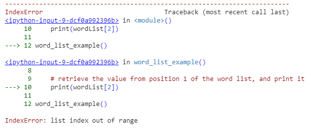

author: Scott Morgan
summary: The main themes in the third part of the course are adding information to list and array data structures, and handling information in string form.
id: part-3
categories: btec-unit4
environments: Web
status: Draft
feedback link: https://github.com/Scott3142/python-programming
analytics account: UA-49751789-4

# Part 3

## Recurring problems and patterns to solve them

### What you'll learn
* Know the term perceptual blindness, and can learn to recognize essential (and non-essential) information with practice.
* Know ways to comment code, and understand the importance of variable names on readability of your code.
* Know the concept print-debugging, and know how to search for errors in the source code by printing.

We've so far been practicing the fundamentals of the language, such as variables, conditionals, loops, and methods. Let's now move on to look at some of the factors affecting the understandability of programs, and how errors are found.

## A Programmer Blind to Their Own Code

A programmer often becomes blind to their code. Let's familiarize ourselves with this effect with the aid of the short video below. Count how many times the white-shirted players pass the ball between each other. The video contains instructions in English.

[[embed url=https://www.youtube.com/watch?v=Ahg6qcgoay]]

There's something else that also happens in the video that may go unnoticed at first. This effect is known as perceptual blindness, and is explained by the fact that as we focus on a specific task, our brains tend to filter out information that is irrelevant to that task. However, we don't always know what information is, in fact, essential and what is not - an example of this being when we study. Concentrating on a specific part of a study exercise can lead to relevant information being filtered out.

Fortunately, applying oneself to a given task lessens the occurrence of perceptual blindness. In other words, practice develops one's ability to distinguish between relevant and irrelevant information.

One way in which perceptual blindness manifests itself in programming practice is when concentrating on a specific part of a program draws attention away from seemingly correct, yet erroneous parts. For instance, while inspecting the correctness of a program's output, a programmer may fixate on the print statements, and mistakenly neglect some aspects of the logic.

Likewise, a programmer may focus on the most complicated aspect of a program featuring a loop, when in fact the error lies somewhere else completely. An example of this is the program below, which is used to calculate the average of user-inputted values. It contains an error, and when searching for it, the loop is typically the first target of focus.

 ```python
values = 0
sum = 0

while (True):
    value = int(input("Provide a value, a negative value ends the program"))
    if (value < 0):
        break

    values = values + 1
    sum = sum + value

if (sum == 0):
    print("The average of the values could not be calculated.")
else:
    print("Average of values: " + str(1.0 * sum / values))
```

Perceptual blindness is something that one cannot be eliminated completely. However, there are ways by which a programmer can lessen its effect - the first one being taking breaks, which requires that work is begun early. Code comments, proper naming of things, and "debugging" prints are additional examples of things that are also helpful.

### Commenting the Source Code

Comments have many purposes, and one of them is explaining how the code works to oneself when searching for bugs. The execution of a relatively simple program is described below through the use of comments.

 ```python

"""
 Prints the numbers from ten to one.
Each number is printed on its own line.
"""

# We create an integer variable named value,
# assigning the value 10 to it.
int value = 10

# The loop execution continues until
# the value of the variable named value is less than or equal to
# zero. The excution doesn't stop _immediately_ when the value zero
# is assigned to the variable, but only when the condition of the
# loop is evaluated the following time.
# This always happens after the loop has executed
while (value > 0):
    # we print out the value in the variable and a new line
    print(value)
    # we decrement the value by one
    value = value - 1
}
```

Comments have no impact on the execution of the program, i.e., the program works in the same way with the comments as it does without them.

The comment style displayed above that is intended for learning purposes is, however, too elaborate for real development, where the goal is for the source code to be **self documenting**. This means that the functionality of the program should be evident from the way classes, methods, and variables are named.

The example can be "commented out" by encapsulating the code into an appropriately named method. Below are two examples of methods that do this - one of the methods is more general in its purpose compared to the other. The more general method assumes, however, that the user knows which of the two parameters is assigned the higher value and which the lower.

 ```python
def printValuesFromTenToOne():
    value = 10
    while (value > 0):
        print(value)
        value = value - 1
```

 ```python
def printValuesFromLargestToSmallest(start, end):
    while (start >= end):
        print(start)
        start = start - 1
```

### Searching for Errors with Print Debugging

One required skill in programming is the ability to test and debug when searching for errors. The simplest way to search for errors is to use so-called print debugging, which in practice involves adding messages to certain lines of code. These messages are used to follow the flow of the program's execution, and can also contain values of variables that live in the program.

Let's inspect the program already familiar to us from the previous question that was used to calculate the average of non-negative values.

 ```python
values = 0
sum = 0

while (True):
    value = int(input("Provide a value, a negative value ends the program"))
    if (value < 0):
        break

    values = values + 1
    sum = sum + value

if (sum == 0):
    print("The average of the values could not be calculated.")
else:
    print("Average of values: " + str(1.0 * sum / values))
}
```

Had the program contained an error, print debugging could have been used to unravel its functionality by adding print statements in the appropriate places. The example below contains one possible example of a program containing print-debug statements.

 ```python
values = 0
sum = 0

while (True):
    print("-- values: " + str(values) + ", sum: " + str(sum))

    value = int(input("Provide a value, a negative value ends the program"))
    if (value < 0):
        print("-- value is negative, exiting loop")
        break

    values = values + 1
    sum = sum + value

print("-- loop exited")
print("-- values: " + str(values) + ", sum: " + str(sum))

if (sum == 0):
    print("The average of the values could not be calculated.")
else:
    print("Average of values: " + str(1.0 * sum / values))
```

When a program is executed multiple times with appropriate inputs the hidden error is often found. Coming up with relevant inputs is a skill in its own right. It's essential to test the so-called corner cases, i.e., circumstances where the program execution could be exceptional. An example scenario would be one where the user does not enter a single acceptable value or enters zeros or very large values.

## Lists

### What you'll learn
* You are familiar with the list structure and know how to use a list in a program.
* You are familiar with the concept of an index, you can add values to a list, and you know how to retrieve information from a list's indices.
* You know how to iterate over a list with multiple different loop types.
* You know how to check if a value exists in a list, and also know how to remove values from a list.
* You are aware of the list being a reference-type variable, and become familiar with using lists as method parameters.

In programming, we often encounter situations where we want to handle many values. The only method we've used so far has been to define a separate variable for storing each value. This is impractical.

```python
word1 = "Hello"
word2 = "world."
word3 = "How"
word4 = "are"
word5 = "you"
word6 = "today?"
```

The solution presented above is useless in effect -- consider a situation in which there are thousands of words to store.

Programming languages offer tools to assist in storing a large quantity of values. We will next take a peek at perhaps the single most used tool in Python, the [list]https://docs.python.org/3.8/tutorial/datastructures.html?highlight=lists), which is used for storing many values.

The list tool offers various methods, including ones for adding values to the list, removing values from it, and also for the retrieval of a value from a specific place in the list. The concrete implementations -- i.e., how the list is actually programmed -- has been abstracted behind the methods, so that a programmer making use of a list doesn't need to concern themselves with its inner workings.

### Using and Creating Lists

Creating a new list is done with the command `list_name = []`, where the values to be stored in the list are included in the square brackets. We create a list for storing strings in the example below.

```python
def main():
    # create a list
    my_list = []

    # the list isn't used yet
```

The type of the my_list variable is `list`. The list can hold multiple variable types at each of its indices, in contrast to other programming languages such as Java where all the variables stored in a given list are of the same type.

### Adding to a List and Retrieving a Value from a Specific Place

The next example demonstrates the addition of a few strings into a list containing strings. Addition is done with the list method `add`, which takes the value to be added as a parameter. We then print the value at position zero. To retrieve a value from a certain position, you using `my_list[2]` syntax, where the square brackets are given the place of retrieval as a parameter.

To call a list method you first write the name of the variable describing the list, followed by a dot and the name of the method.

```python
def word_list_example():
    # create the word list
    wordList = []

    # add two values to the word list
    wordList.append("First")
    wordList.append("Second")

    # retrieve the value from position 0 of the word list, and print it
    print(wordList[0])

word_list_example()
```

Negative
: First

As can be seen, this method retrieves the first value from the list when it is given the parameter `0`. This is because **list positions are counted starting from zero**. The first value is found by `wordList[0]`, the second by `wordList[0]`, and so on.

```python
def word_list_example():
    # create the word list
    wordList = []

    # add two values to the word list
    wordList.append("First")
    wordList.append("Second")

    # retrieve the value from position 1 of the word list, and print it
    print(wordList[1])

word_list_example()
```

Negative
: Second

You can also use negative indexing, which means beginning from the end. For example, -1 refers to the last item, -2 refers to the second last item and so on, as seen below:

```python
def word_list_example():
    # create the word list
    wordList = []

    # add two values to the word list
    wordList.append("First")
    wordList.append("Second")
    wordList.append("Thirdd")

    # retrieve the value from the last position of the word list, and print it
    print(wordList[-1])

word_list_example()
```

Negative
: Third

Positive
: **Exercise - Third Element** <br><br> Read the instructions for the exercise and commit the solution via Github. <br><br> [Source files on Github](https://github.com/btec-diploma-unit4-programming-master/exercise-3-1-third-element.git)

Positive
: **Exercise - Second Plus Third** <br><br> Read the instructions for the exercise and commit the solution via Github. <br><br> [Source files on Github](https://github.com/btec-diploma-unit4-programming-master/exercise-3-2-second-plus-third.git)

### Retrieving Information from a "Non-Existent" Place

If you try to retrieve information from a place that does not exist on the list, the program will print an `IndexError`. In the example below, two values are added to a list, after which there is an attempt to print the value at place two on the list.

```python
def word_list_example():
    # create the word list
    wordList = []

    # add two values to the word list
    wordList.append("First")
    wordList.append("Second")

    # retrieve the value from position 1 of the word list, and print it
    print(wordList[2])

word_list_example()
```

Since the numbering (i.e., **indexing**) of the list elements starts with zero, the program isn't able to find anything at place two and its execution ends with an error. Below is a description of the error message caused by the program.

**Example output:**



Positive
: **A Place in a List Is Called an Index** <br><br> Numbering places, i.e., indexing, always begins with zero. The list's first value is located at index 0, the second value at index 1, the third value at index 2, and so on. In programs, an index is denoted with a variable called `i`.

### Iterating Over a List

We'll next be examining methods that can be used to go through the values on a list. Let's start with a simple example where we print a list containing four values.

```python
teachers = []

teachers.append("Simon")
teachers.append("Samuel")
teachers.append("Ann")
teachers.append("Anna")

print(teachers[0])
print(teachers[1])
print(teachers[2])
print(teachers[3])
```

Negative
: Simon <br> Samuel <br> Ann <br> Anna

The example is obviously clumsy. What if there were more values on the list? Or fewer? What if we didn't know the number of values on the list?

The number of values on a list is provided by the list's **len** method which returns the number of elements the list contains. The number is an integer, and it can be used as a part of an expression or stored in a variable for later use.

```python
list = []
print("Number of values on the list: " + str(len(list)))

list.append("First")
print("Number of values on the list: " +str(len(list)))

values = len(list)

list.append("Second")
print("Number of values on the list: " + str(values))
```

Negative
: Number of values on the list: 0 <br> Number of values on the list: 1 <br> Number of values on the list: 1

Positive
: **Exercise - List size** <br><br> Read the instructions for the exercise and commit the solution via Github. <br><br> [Source files on Github](https://github.com/btec-diploma-unit4-programming-master/exercise-3-3-list-size.git)

### Iterating Over a List Continued

Let's make a new version of the program that prints each index manually. In this intermediate version we use the `index` variable to keep track of the place that is to be outputted.

```python
teachers = []

teachers.append("Simon")
teachers.append("Samuel")
teachers.append("Ann")
teachers.append("Anna")

index = 0

if index < len(teachers):
    print(teachers[index])  # index = 0
    index = index + 1  # index = 1

if index < len(teachers):
    print(teachers[index])  # index = 1
    index = index + 1  # index = 2

if index < len(teachers):
    print(teachers[index])  # index = 2
    index = index + 1  # index = 3

if index < len(teachers):
    print(teachers[index])  # index = 3
    index = index + 1  # index = 4

if index < len(teachers):
    # this will not be executed since index = 4 and len(teachers) = 4
    print(teachers[index])
    index = index + 1
```

We can see that there's repetition in the program above.

We can convert the `if` statements into a `while` loop that is repeated until the condition `index < len(teachers)` no longer holds (i.e., the value of the variable `index` grows too great).

```python
teachers = []

teachers.append("Simon")
teachers.append("Samuel")
teachers.append("Ann")
teachers.append("Anna")

index = 0
# Repeat for as long as the value of the variable `index`
# is smaller than the size of the teachers list
while index < len(teachers):
    print(teachers[index])
    index = index + 1
```

Now the printing works regardless of the number of elements.

The for-loop we inspected earlier used to iterate over a known number of elements is extremely handy here. We can convert the loop above to a `for`-loop, after which the program looks like this.

```python
teachers = []

teachers.append("Simon")
teachers.append("Samuel")
teachers.append("Ann")
teachers.append("Anna")

for index in range(len(teachers)):
     print(teachers[index])
```

Negative
: Simon <br> Samuel <br> Ann <br> Anna

Python actually has a "better" way of accessing list items in a for loop which is different to certain other languages. You can use the syntax `for item in list` to access each item like so:

```python
teachers = []

teachers.append("Simon")
teachers.append("Samuel")
teachers.append("Ann")
teachers.append("Anna")

for teacher in teachers:
     print(teachers)
```

There are certain reasons why you'd use `range(len(list))` but most of the time we will use the latter of these two options.

Let's consider using a list to store integers. The functionality is largely the same as in the previous example.

```python
numbers = []

numbers.append(1)
numbers.append(2)
numbers.append(3)
numbers.append(4)

for number in numbers:
    print(numbers)
```

Negative
: 1 <br> 2 <br> 3 <br> 4

Printing the numbers in the list in reverse order would also be straightforward.

```python
numbers = []

numbers.append(1)
numbers.append(2)
numbers.append(3)
numbers.append(4)

index = len(numbers) - 1
while index >= 0:
    number = numbers[index]
    print(number)
    index = index - 1
```

Negative
: 4 <br> 3 <br> 2 <br> 1

Try and recreate the previous example with the for loop!

Positive
: **Notice about the following exercises** <br><br> The next exercises are meant for learning to use lists and indices. Even if you could complete the exercises without a list, concentrate on training to use it. The functionality in the exercises is to be implemented after reading the input numbers.

Positive
: **Exercise - Last in list** <br><br> Read the instructions for the exercise and commit the solution via Github. <br><br> [Source files on Github](https://github.com/btec-diploma-unit4-programming-master/exercise-3-4-last-in-list.git)

Positive
: **Exercise - First and last** <br><br> Read the instructions for the exercise and commit the solution via Github. <br><br> [Source files on Github](https://github.com/btec-diploma-unit4-programming-master/exercise-3-5-first-and-last.git)

Positive
: **Exercise - Reember these numbers** <br><br> Read the instructions for the exercise and commit the solution via Github. <br><br> [Source files on Github](https://github.com/btec-diploma-unit4-programming-master/exercise-3-6-remember-these-numbers.git)

Positive
: **Exercise - Only these numbers** <br><br> Read the instructions for the exercise and commit the solution via Github. <br><br> [Source files on Github](https://github.com/btec-diploma-unit4-programming-master/exercise-3-7-only-these-numbers.git)

Positive
: **Exercise - Greatest in list** <br><br> Read the instructions for the exercise and commit the solution via Github. <br><br> [Source files on Github](https://github.com/btec-diploma-unit4-programming-master/exercise-3-8-greatest-in-list.git)

Positive
: **Exercise - Index of** <br><br> Read the instructions for the exercise and commit the solution via Github. <br><br> [Source files on Github](https://github.com/btec-diploma-unit4-programming-master/exercise-3-9-index-of.git)

Positive
: **Exercise - Index of smallest** <br><br> Read the instructions for the exercise and commit the solution via Github. <br><br> [Source files on Github](https://github.com/btec-diploma-unit4-programming-master/exercise-3-10-index-of-smallest.git)

Positive
: **Exercise - Sum of a list** <br><br> Read the instructions for the exercise and commit the solution via Github. <br><br> [Source files on Github](https://github.com/btec-diploma-unit4-programming-master/exercise-3-11-sum-of-a-list.git)

Positive
: **Exercise - Average of a list** <br><br> Read the instructions for the exercise and commit the solution via Github. <br><br> [Source files on Github](https://github.com/btec-diploma-unit4-programming-master/exercise-3-12-average-of-a-list.git)

### Removing from a List and Checking the Existence of a Value

In Python, list's methods `clear()`, `pop()`, and `remove()` are used to remove items (elements) from a list.

- Remove all items: clear()
- Remove an item by index and get its value: pop()
- Remove an item by value

```python
my_list = list(range(10))
print(my_list)

print(my_list.pop(0))

print(my_list.pop(3))
```

Negative
: [0, 1, 2, 3, 4, 5, 6, 7, 8, 9] <br> [1, 2, 3, 4, 5, 6, 7, 8, 9] <br> [1, 2, 3, 5, 6, 7, 8, 9]

Note that the list is edited *in place*, meaning that the value of `my_list` is overwritten by `pop()`.

You can remove the first item from the list where its value is equal to the specified value with `remove()`.

```python
my_list = ['Alice', 'Bob', 'Charlie', 'Bob', 'Dave']
print(my_list)

print(my_list.remove('Alice'))

print(my_list.pop('Bob'))
```

Negative
: ['Alice', 'Bob', 'Charlie', 'Bob', 'Dave'] <br> ['Bob', 'Charlie', 'Bob', 'Dave'] <br> ['Charlie', 'Bob', 'Dave']

Note that if the list contains more than one matching the specified value, only the first one is deleted.

The list method **in** can be used to check the existence of a value in the list. The method receives the value to be searched as its parameter, and it returns a boolean type value (`True` or `False`) that indicates whether or not that value is stored in the list.

```python
list = ["First","Second","Third"]

 print("Is the first found? " + str("First" in list))

found = "Second" in list
if found:
     print("Second was found")

# or more simply
if "Second" in list:
     print("Second can still be found")
```

Negative
: Is the first found? true <br> Second was found <br> Second can still be found

Positive
: **Exercise - On the list** <br><br> Read the instructions for the exercise and commit the solution via Github. <br><br> [Source files on Github](https://github.com/btec-diploma-unit4-programming-master/exercise-3-13-on-the-list.git)

### List as a Method Parameter

Like other variables, a list can be used as a parameter to a method too. When the method is defined to take a list as a parameter, the type of the parameter is defined as the type of the list and the type of the values contained in that list. Below, the method `print` prints the values in the list one by one.

```python
def printout(list):
    for value in list:
         print(value)

my_list = ["One","Two"]
printout(my_list)
```
Negative
: One <br> Two

The chosen parameter in the method definition is not dependent on the list that is passed as parameter in the method call. In the program that calls `printout`, the name of the list variable is `list`, but inside the method `printout` the variable is called `my_list` -- the name of the variable that stores the list could also be `printables`, for instance.

It's also possible to define multiple variables for a method. In the example the method receives two parameters: a list of numbers and a threshold value. It then prints all the numbers in the list that are smaller than the second parameter.

```python
def printSmallerThan(numbers, threshold):
    for number in numbers:
        if (number < threshold):
             print(number)

list = [1,2,3,2,1]
printSmallerThan(list, 3)
```

Negative
: 1 <br> 2 <br> 2 <br> 1

Positive
: **Exercise - Print in range** <br><br> Read the instructions for the exercise and commit the solution via Github. <br><br> [Source files on Github](https://github.com/btec-diploma-unit4-programming-master/exercise-3-14-print-in-range.git)

As before, a method can also return a value. The methods that return values have the `return` command. The method below returns the size of the list.

```python
def size(list):
    return len(list)
```

You can also define own variables for methods. The method below calculates the average of the numbers in the list. If the list is empty, it returns the number -1.

```python
def average(numbers):
    if (len(numbers) == 0):
        return -1

    sum = 0
    for number in numbers:
        sum = sum + number

    return sum / len(numbers)
}
```

Positive
: **Exercise - Sum** <br><br> Read the instructions for the exercise and commit the solution via Github. <br><br> [Source files on Github](https://github.com/btec-diploma-unit4-programming-master/exercise-3-15-sum.git)

### On Copying the List to a Method Parameter

Earlier we have used integers, floating point numbers, etc. as method parameters. When variables such as `int` are used as method parameters, the value of the variable is copied for the method's use. The same occurs in the case that the parameter is a list.

Lists, among practically all the variables that can store large amounts of information, are _reference-type variables_. This means that the value of the variable is a reference that points to the location that contains the information.

When a list (or any reference-type variable) is copied for a method's use, the method receives the value of the list variable, i.e., a _reference_. In such a case the **method receives a reference to the real value of a reference-type variable**, and the method is able to modify the value of the original reference type variable, such as a list. In practice, the list that the method receives as a parameter is the same list that is used in the program that calls the method.

Let's look at this briefly with the following method.

```python
def removeFirst(numbers):
    if len(numbers) == 0:
        return

    numbers.pop(0)

numbers = [3,2,6,-1]
print(numbers)

removeFirst(numbers)
print(numbers)

removeFirst(numbers)
removeFirst(numbers)
removeFirst(numbers)
print(numbers)
```


Negative
: [3, 2, 6, -1] <br> [2, 6, -1] <br> []

Positive
: **Exercise - Remove last** <br><br> Read the instructions for the exercise and commit the solution via Github. <br><br> [Source files on Github](https://github.com/btec-diploma-unit4-programming-master/exercise-3-16-remove-last.git)
